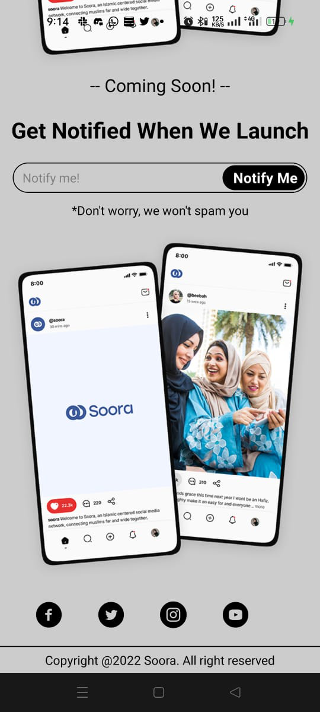

# Soora

[GitHub Link](https://github.com/Ogalo/Soora-App)

# Soora App

This is an mobile app that will be used to unite and bring muslims together for a common goal.

# Objective

**To Unite.**

# Know More About the Soora App

### Front-end

- run `npm install` or `yarn install` to install all dependencies.
- To view the demo app. Kindly install `Expo Go` app
available for both android and IOS.
- Scan the code for review.

### Backend API

- No backend yet.

### Technology Used

React Native

Figma

Javascript

Expo Go (for free hosting of the mobile application)

CSS (for styling)

## Contact Information

email: ogaloharrison@gmail.com / otienoharrison9@gmail.com

Name: Harrison Omondi Otieno

Alias: Ogalo

Phone no: +254799820376
